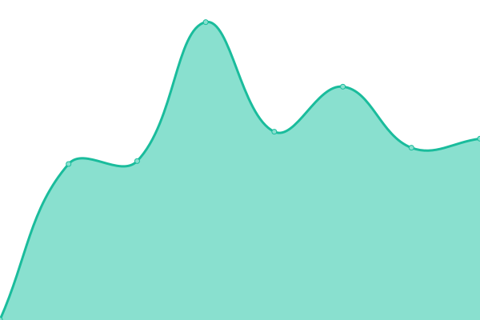

# [📈 Live Status](https://upptime.github.io/upptime): <!--live status--> **🟩 All systems operational**

This repository contains the open-source uptime monitor and status page for [Upptime](https://upptime.js.org), powered by [Upptime](https://github.com/upptime/upptime).

With [Upptime](https://upptime.js.org), you can get your own unlimited and free uptime monitor and status page, powered entirely by a GitHub repository. We use [Issues](https://github.com/upptime/upptime/issues) as incident reports, [Actions](https://github.com/mizipets/upptime/actions) as uptime monitors, and [Pages](https://upptime.github.io/upptime) for the status page.

<!--start: status pages-->
<!-- This summary is generated by Upptime (https://github.com/upptime/upptime) -->
<!-- Do not edit this manually, your changes will be overwritten -->
<!-- prettier-ignore -->
| URL | Status | History | Response Time | Uptime |
| --- | ------ | ------- | ------------- | ------ |
|  [Mizipet](https://mizipet.com) | 🟩 Up | [mizipet.yml](https://github.com/mizipets/uptime/commits/HEAD/history/mizipet.yml) | 

 678ms
     
 | 

<a href="https://mizipets.github.io/uptime/history/mizipet">100.00%</a>
    

|  [Mizipet Pro](https://pro.mizipet.com) | 🟩 Up | [mizipet-pro.yml](https://github.com/mizipets/uptime/commits/HEAD/history/mizipet-pro.yml) | 

 675ms
     
 | 

<a href="https://mizipets.github.io/uptime/history/mizipet-pro">100.00%</a>
    

|  [Mizipet Api](https://api.mizipet.com/v1) | 🟩 Up | [mizipet-api.yml](https://github.com/mizipets/uptime/commits/HEAD/history/mizipet-api.yml) | 

 550ms
     
 | 

<a href="https://mizipets.github.io/uptime/history/mizipet-api">100.00%</a>
    

<!--end: status pages-->

[**Visit our status website →**](https://upptime.github.io/upptime)

## 📄 License

- Powered by: [Upptime](https://github.com/upptime/upptime)
- Code: [MIT](./LICENSE) © [Anand Chowdhary](https://anandchowdhary.com), supported by [Pabio](https://pabio.com)
- Data in the `./history` directory: [Open Database License](https://opendatacommons.org/licenses/odbl/1-0/)
